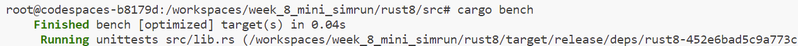
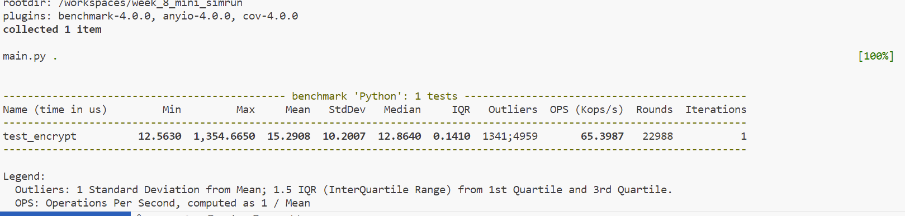

# Comparison: Rust v. Python

Rust and C use approzimately 1.00 J of energy and also the time for computational performance for both is approzimately 1.00 ms. However, when we consider Python, 70 times more energy and time is being used by python, comparitvely. From a sustainability, perspective this project considers should we move from Python to Rust. Rust and Python syntax isn't too different and thus we could save budget and be thoughtful towards reaching sustainability goals. 

## Functions
The functions that I will be using is an encrypt and decrypt cipher. I have a dataset that contains 1000 fortune cookies that contain hidden messsages. These messages are hidden by using the encrypt function to encrypt each of the messages and when someone uses my setup tool called "fortune" they will be able to get a randomly generated fortune that has been take from teh encrypted database and decrypted. The purpose of this project is to try and test to see the time and energy efficiency of doing this project in rust or python.

## Code Overview

For testing in Rust and Python I used criterion and pytest-benchmark. Rust took 40 ms and Python used 15.2908 ms for the execution of encryption and decryption code. This shows that Rust is faster than Python. 

## Rust

- First I installed Rust and Rust-analyzer extensions.
- You can use Cargo new which gives you a Cargo.toml file that with the proper version and dependicies. You will also be given a main.rs where you can write your main rust script. 
- The execution of the code for Cargo is: 

## Python
- For testing I used pytest-benchmark for my main.py
- To run pytest you use pytest main.py
- When you run pytest you can learn the different metrics liek Mean, Min, Max, etc time it took for the code to run. 

